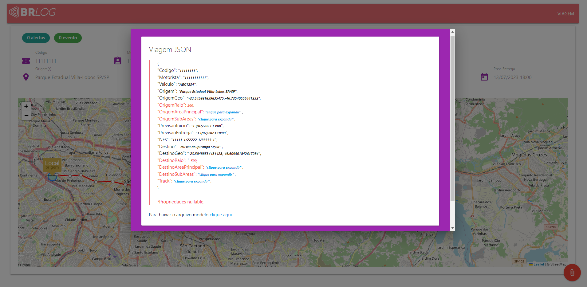

#BRLogFrontDocs.Web

#30995

Link de acesso: https://testes.brasilrisk.com.br/BRLogFrontDocs

:articulated_lorry: Esse repositório é um projeto frontend das principais features utilizadas nos sistemas logísticos da BRK. :articulated_lorry:

- Exibições das principais informações de viagem;
- Exibições e renderizações no mapa conforme condições de dados;

:rocket: O objetivo aqui é estruturarmos usos e conceitos das principais bibliotecas que utilizamos, até mesmo para estudo e lançamento de novos recursos que possam ser compartilhados com toda a equipe. Além de ter uma visão geral de nossas entidades e domínio de negócio. :rocket:

Temos nesse projeto:

- MaterializeCSS
- LeafletJS
- MomentJS

:smile: :smile: :smile:  
Seja bem-vindo(a) e contribua com o desenvolvimento open-source desse repositório.
Evoluindo assim ideia e técnica de desenvolvimento frontend.

:warning: As aprovações para a branch main serão aprovadas via Pull Request a partir de uma nova branch de desenvolvimento. :warning:

:raising_hand:
Temos alguns desafios pela frente: :raising_hand:

- Colocar o sistema para permitir que o usuário escolha qual tema CSS quer usar (Dark ou Light)
- Implementar no JSON e na renderização do mapa mais de uma origem e mais de um destino
- Fazer tratativas nos imput para que as informações não fiquem muito cumpridas quebrando a estética limpa da página
- Colocar novos campos no JSON como alertas, ocorrências e renderizar num grid utilizando o Datatable.JS

:bulb: E o que mais puder imaginar :bulb:

